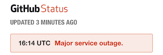

# Mirror Github Repos/Wiki/Issues
Prepared for the next Github outage. [Tutorial](tutorial.md)

## Compile for Pi
`env GOOS=linux GOARCH=arm GOARM=7 go build -o github-mirror-arm`

## Todo
- [ ] import the repos into [gitea](https://gitea.io/en-US/)
- [ ] check how issue attachment are managed
- [ ] make the systemd file readonly for everyone but owner, so nobody can read the credentials

## More informations
* https://github.com/qvl/ghbackup
* https://help.github.com/articles/duplicating-a-repository/#mirroring-a-repository-in-another-location
